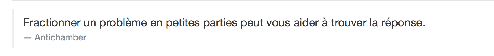
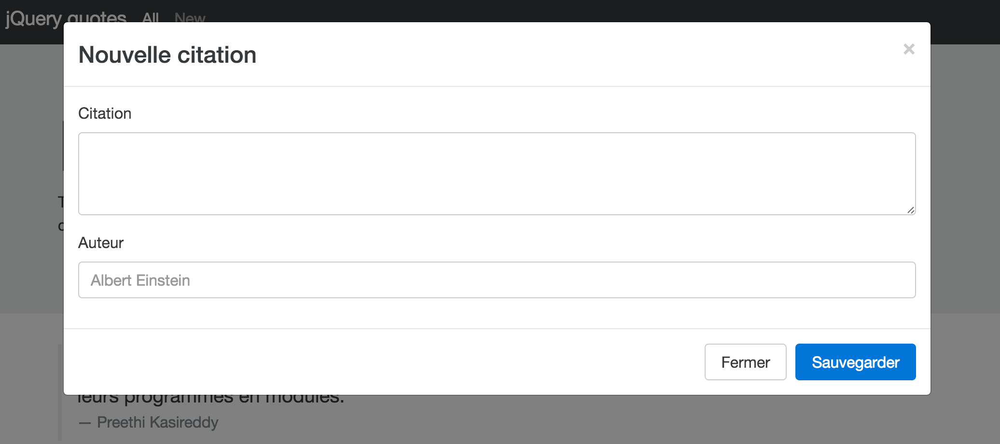

## Background & Objectives

Today you need to remeber what you have learned about jQuery & JavaScript of Bootstrap.
You don't need to code CSS here, simply use the framework.

We are going to use [Bootstrap V4](http://v4-alpha.getbootstrap.com).

## TODO

#### Fetch json data form `http://webcitation.fr/quotes.json`

Add a nice `<blockquote>` like this in `js-content`

#### Use `.load()` function on the author page

You can find the [documentation here](http://api.jquery.com/load/).

- Add an event when a use click on a button
- Load the text on bio.txt & insert it on `#js-bio`

#### Insert a modal for new quote

Don't forget to use a nice naming like `js-modal-newquote`

